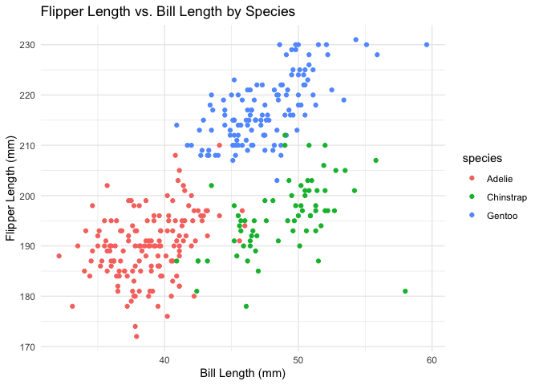

Problem 1
================
Zicheng Wang
2024-09-16

Loading the penguins dataset and library ggplot

``` r
data("penguins", package = "palmerpenguins")
library(ggplot2)
```

Discription of the dataset:

``` r
rows <- nrow(penguins)
cols <- ncol(penguins)
species <- paste(unique(penguins$species), collapse = ", ")
islands <- paste(unique(penguins$island), collapse = ", ")
bi_length_min <- min(penguins$bill_length_mm, na.rm = TRUE)
bi_length_max <- max(penguins$bill_length_mm, na.rm = TRUE)
bi_depth_min <- min(penguins$bill_depth_mm, na.rm = TRUE)
bi_depth_max <- max(penguins$bill_depth_mm, na.rm = TRUE)
fl_length_min <- min(penguins$flipper_length_mm, na.rm = TRUE)
fl_length_max <- max(penguins$flipper_length_mm, na.rm = TRUE)
bm_min <- min(penguins$body_mass_g, na.rm = TRUE)
bm_max <- max(penguins$body_mass_g, na.rm = TRUE)
means <- mean(penguins$flipper_length_mm, na.rm = TRUE)
```

The `penguins` dataset consists of measurements of penguins: The dataset
contains **344** rows and **8** columns. Have species, island, sex, bill
length, bill depth, flipper length and body mass variables.  
These penguins came from three different species: **Adelie, Gentoo,
Chinstrap**.  
The penguins were studied on three islands: **Torgersen, Biscoe,
Dream**.  
Bill length (in mm): ranges from **32.1** to **59.6** mm  
Bill depth (in mm): ranges from **13.1** to **21.5** mm  
Flipper length (in mm): ranges from **172** to **231** mm  
Body mass (in g): ranges from **2700** to **6300** g  
The mean flipper length of the penguins is **200.9152047** mm.

Create scatterplot of Flipper length and bill length by different
species Using `theme_minimal()` as the theme

``` r
p <- ggplot(penguins, aes(x = bill_length_mm, y = flipper_length_mm, color = species)) +
  geom_point() +
  labs(title = "Flipper Length vs. Bill Length by Species", 
       x = "Bill Length (mm)", 
       y = "Flipper Length (mm)") +
  theme_minimal()
```

Display the plot

``` r
print(p)
```

    ## Warning: Removed 2 rows containing missing values or values outside the scale range
    ## (`geom_point()`).

<!-- -->

Save the scatterplot to the project directory

``` r
ggsave("Scatterplot_penguins.png", plot = p)
```

    ## Saving 7 x 5 in image

    ## Warning: Removed 2 rows containing missing values or values outside the scale range
    ## (`geom_point()`).
