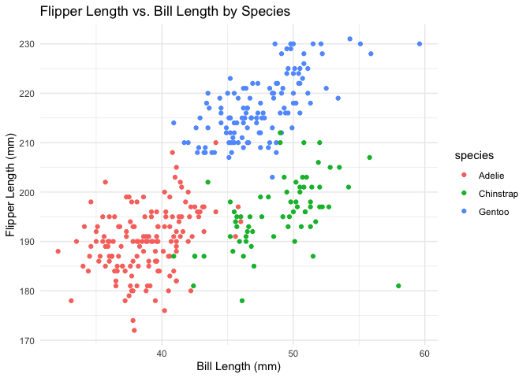

Problems in Homework1
================
Zicheng Wang
2024-09-16

## Problem 1

Loading the penguins dataset and necessary packeges for the problems

``` r
data("penguins", package = "palmerpenguins")
library(tidyverse)
```

    ## ── Attaching core tidyverse packages ──────────────────────── tidyverse 2.0.0 ──
    ## ✔ dplyr     1.1.4     ✔ readr     2.1.5
    ## ✔ forcats   1.0.0     ✔ stringr   1.5.1
    ## ✔ ggplot2   3.5.1     ✔ tibble    3.2.1
    ## ✔ lubridate 1.9.3     ✔ tidyr     1.3.1
    ## ✔ purrr     1.0.2     
    ## ── Conflicts ────────────────────────────────────────── tidyverse_conflicts() ──
    ## ✖ dplyr::filter() masks stats::filter()
    ## ✖ dplyr::lag()    masks stats::lag()
    ## ℹ Use the conflicted package (<http://conflicted.r-lib.org/>) to force all conflicts to become errors

Discription of the dataset:

``` r
rows <- nrow(penguins)
cols <- ncol(penguins)
species <- paste(unique(penguins$species), collapse = ", ")
islands <- paste(unique(penguins$island), collapse = ", ")
bi_length_min <- min(penguins$bill_length_mm, na.rm = TRUE)
bi_length_max <- max(penguins$bill_length_mm, na.rm = TRUE)
bi_depth_min <- min(penguins$bill_depth_mm, na.rm = TRUE)
bi_depth_max <- max(penguins$bill_depth_mm, na.rm = TRUE)
fl_length_min <- min(penguins$flipper_length_mm, na.rm = TRUE)
fl_length_max <- max(penguins$flipper_length_mm, na.rm = TRUE)
bm_min <- min(penguins$body_mass_g, na.rm = TRUE)
bm_max <- max(penguins$body_mass_g, na.rm = TRUE)
means <- mean(penguins$flipper_length_mm, na.rm = TRUE)
```

The `penguins` dataset consists of measurements of penguins: The dataset
contains **344** rows and **8** columns. Have species, island, sex, bill
length, bill depth, flipper length and body mass variables.  
These penguins came from three different species: **Adelie, Gentoo,
Chinstrap**.  
The penguins were studied on three islands: **Torgersen, Biscoe,
Dream**.  
Bill length (in mm): ranges from **32.1** to **59.6** mm  
Bill depth (in mm): ranges from **13.1** to **21.5** mm  
Flipper length (in mm): ranges from **172** to **231** mm  
Body mass (in g): ranges from **2700** to **6300** g  
The mean flipper length of the penguins is **200.9152047** mm.

Create scatterplot of Flipper length and bill length by different
species Using `theme_minimal()` as the theme

``` r
p <- ggplot(penguins, aes(x = bill_length_mm, y = flipper_length_mm, color = species)) +
  geom_point() +
  labs(title = "Flipper Length vs. Bill Length by Species", 
       x = "Bill Length (mm)", 
       y = "Flipper Length (mm)") +
  theme_minimal()
```

Display the plot

``` r
print(p)
```

    ## Warning: Removed 2 rows containing missing values or values outside the scale range
    ## (`geom_point()`).

<!-- -->

Save the scatterplot to the project directory

``` r
ggsave("Scatterplot_penguins.png", plot = p)
```

    ## Saving 7 x 5 in image

    ## Warning: Removed 2 rows containing missing values or values outside the scale range
    ## (`geom_point()`).

## Problem 2

Create a data frame:

``` r
df <- tibble(
  sample_normal = rnorm(10, mean = 0, sd = 1),
  sample_logic = sample_normal > 0,
  sample_char = sample(letters, 10),
  sample_level = factor(sample(c("Level1", "Level2", "Level3"), 10, replace = TRUE))
)
```

Display the data frame to inspect:

``` r
print(df)
```

    ## # A tibble: 10 × 4
    ##    sample_normal sample_logic sample_char sample_level
    ##            <dbl> <lgl>        <chr>       <fct>       
    ##  1        0.884  TRUE         x           Level2      
    ##  2       -0.952  FALSE        k           Level2      
    ##  3       -1.05   FALSE        w           Level1      
    ##  4        0.0939 TRUE         m           Level1      
    ##  5       -0.822  FALSE        u           Level2      
    ##  6        0.635  TRUE         a           Level1      
    ##  7        0.256  TRUE         b           Level2      
    ##  8       -0.261  FALSE        p           Level2      
    ##  9       -0.183  FALSE        v           Level3      
    ## 10        0.153  TRUE         q           Level2

Calculate means of each variable in the data frame:

``` r
mean(df %>% pull(sample_normal))
```

    ## [1] -0.1241594

``` r
mean(df %>% pull(sample_logic))
```

    ## [1] 0.5

``` r
mean(df %>% pull(sample_char))
```

    ## Warning in mean.default(df %>% pull(sample_char)): argument is not numeric or
    ## logical: returning NA

    ## [1] NA

``` r
mean(df %>% pull(sample_level))
```

    ## Warning in mean.default(df %>% pull(sample_level)): argument is not numeric or
    ## logical: returning NA

    ## [1] NA

Change those type of variables that cannot calculate mean into numeric
type:

``` r
df$sample_logic <- as.numeric(df$sample_logic)
df$sample_char <- as.numeric(df$sample_char)
df$sample_level <- as.numeric(df$sample_level)
```

First two lines returned following message:
`Warning: NAs introduced by coercion`, the last line performed without
warnings.
